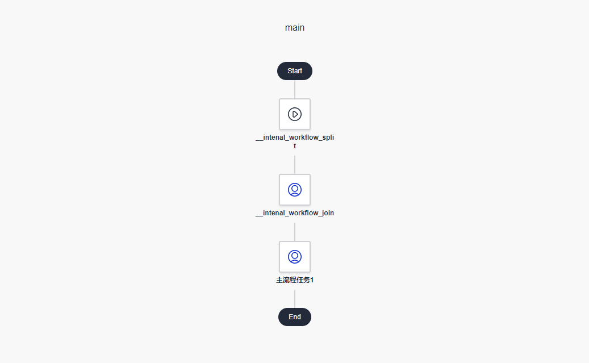
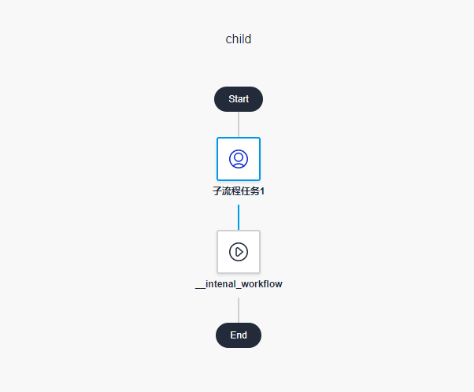
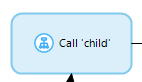

# 痛点

由于 mendix 现有流程功能不能开箱即用的实现动态流程（或者说是不想限制使用者），当我们想要根据上下文决定一个用户任务分配给哪些人时（俗称会签）。更加复杂的场景是，比如有三个领导需要对任务做出审批，只要有两位同意后，就自动进行下一任务环节。

# 方案

- 我们新建主和子两个流程，在主流程中根据领导的数据，`__intenal_workflow_split`批量发起三个子流程。

- 子流程中，领导处理`子流程任务1`后，`__intenal_workflow`判断三个子流程是否满足线束条件（根据你的业务而定，此例便是达到两位领导同意），join 进主流程（结束三个子流程并完成主流程的`__intenal_workflow_join`任务）
- 主流程开始余下的任务节点

# 其它

- 发起子任务可以使用微流工具箱中的

