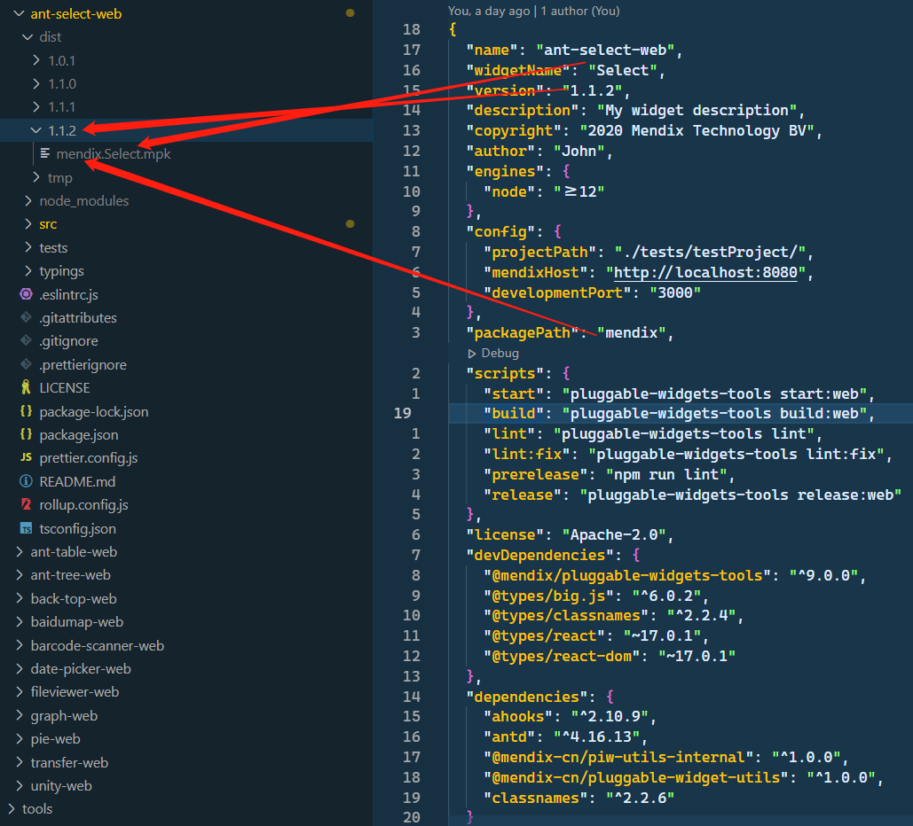
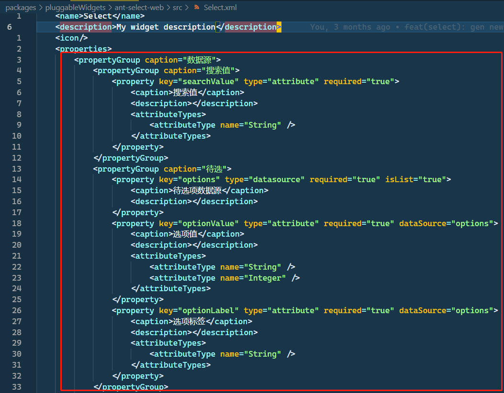
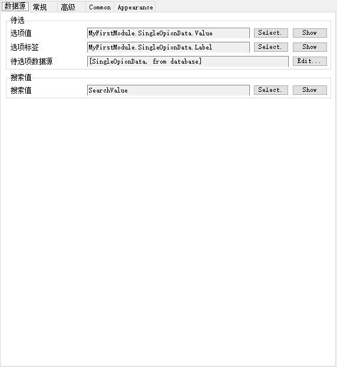
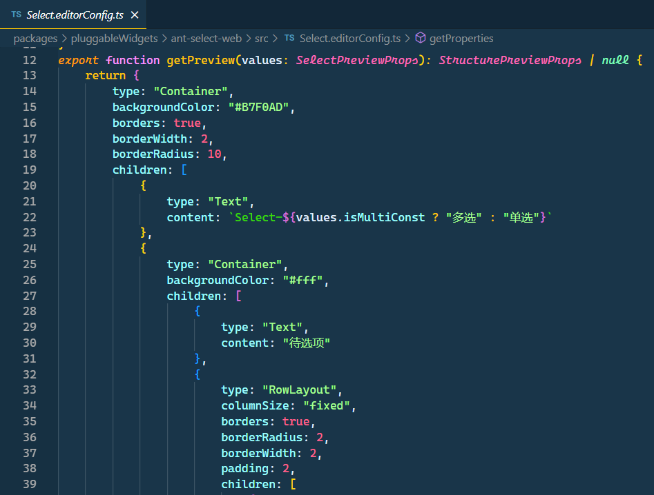
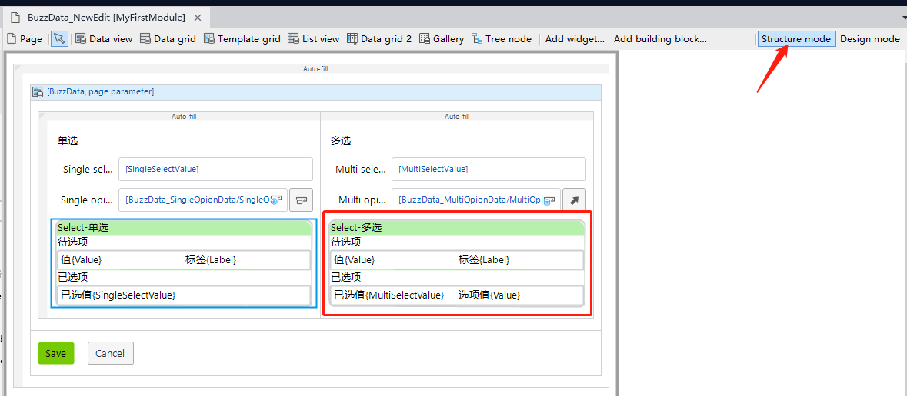

# dist

## dist/{version}/{packagePath}.{widgetName}.mpk

`npm run build` 生产模式下构建前端组件最终产物

## dist/tmp/widgets

`npm run start` 开发模式下编译产生的文件

# src

源代码目录

## src/ui

样式文件目录

## src/package.xml

组件包声明文件

## src/{widgetName}.xml

组件接口声明文件，声明文件用于`mendix studio`或者`mendix studio pro`中此组件的属性对话需要最终开发者指定，如下图

## src/{widgetName}.editorConfig.ts

`mendix studio`或者`mendix studio pro` 中`Structure mode`显示内容

## src/{widgetName}.editorPreview.ts

`mendix studio pro` 中`Design mode`显示的内容(`mendix studio`没有`Design mode`)

## src/{widgetName}.tsx

组件主入口，在此处完成 mendix api 的数据提取和事件分发。

## src/components/

此目录下的 react 组件不应该含有 mendix api，也就是说隔离 mendix。它们理论上应该和 mendix 没有任务关系。

## src/typings/{widgetName}.d.ts

`@mendix/pluggable-widgets-tools`根据`src/{widgetName}.xml`生成的 typescript typing 文件
